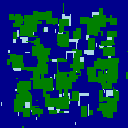
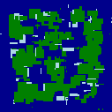
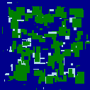
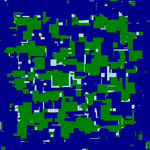
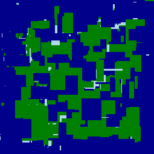
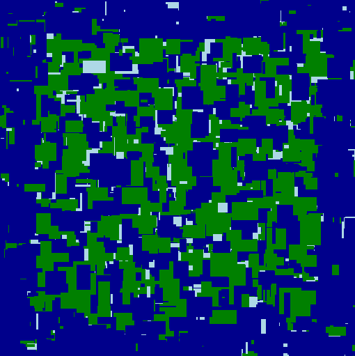

# Assignment 2: u3142846, GA for Map Generation

## Overview

## Initial Goals / Desired map features
- Map with either many rivers, or an Archipelago
- Mountains usually close and in lines, ridges, no big expanses of mountains

## Interesting and Challenging Bits

- Getting my head around phenotype vs genotype
- Thinking abstractly about the features I wanted to evoke in the map
- Having to score per-pixel because general summary (terrain type percentages) wasn't enough
- Slow speed (I made scoring parallel)
- Doing too much score changing for a single pixel type (e.g. water could have to much influence if there were lots of potential score ups for water)
- Added duplicate gene removal and duplicate Genome removal back in

## Effect of changing the Mutation Strategy

- First I just always rolled a new genome as my mutation strategy while I worked on the scoring
- When I came back to the mutation strategy I Decided that more finesse was needed, but I wanted to try avoiding into too much of a local minimum
- Changing the mutation strategy to only mutate some of the genome had the effect that new better scoring maps were, in general, just modification of the old one, so you could actually see an evolution happening, and with generations you could see the desired features refine, rather than suddenly manifest.

## Effect of changing the Scoring System

- Initial scoring with just aggregate counts, bleh
- per-terrain scoring proved effective
- careful not to make one terrain type too overpowered (made the mistake of scoring water up for every water within 10 pixels, but land only for the pixels 20 away, so evolution was just to have a mostly water map)
- Changing aggregate scoring from fixed values to a subtraction based on distance from desired quantities had improvement by channeling towards the desired splits of terrain, without under or overpowering that influence for different sizes of map. (e.g. might be perfect for 256 if it was fixed, but would be overpowered for 128. underpowered for 512)

## Increasing performance with Parallelization

- WAY TOO SLOW
- Thought about using bytes instead of int to store terrain
- Though about scoring, realised scoring is discrete, and doesn't need to write to anything. just read
- dispatched scoring of each column in parallel, got a massive performance boost (perhaps should profile/time exactly how much? Ask rob. HD?)
- Also check if there is a speedul using bytes instead of ints.

## Score Routine

### Code

```csharp
public int setScore()
{
    score = 0;

    int seaCount = 0;
    int landCount = 0;
    int mountainCount = 0;

    Object thisLock = new Object();

    ParallelLoopResult loopResult = Parallel.For(0, Params.dimX, x =>
    {
        for (int y = 0; y < Params.dimY; y++)
        {
            switch (pheno[x, y])
            {
                case 0: // sea

                    int tempSea = scoreSea(x, y);
                    lock (thisLock)
                    {
                        seaCount++;
                        score += tempSea;
                    }
                    break;
                case 1: // land

                    int tempLand = scoreLand(x, y);
                    lock (thisLock)
                    {
                        landCount++;
                        score += tempLand;
                    }
                    break;
                case 2: // mountains
                    int tempMountain = scoreMountains(x, y);
                    lock (thisLock)
                    {
                        mountainCount++;
                        score += tempMountain;
                    }

                    break;
            }
        }
    });

    float totalCount = landCount + seaCount + mountainCount;

    float nearEnough = 0.5f;

    // Adjust score depending on how close to target land count it is
    int targetLandCount = (int) (totalCount * 0.5f);
    int landDiff = Math.Abs(targetLandCount - landCount);
    if (landDiff > totalCount * nearEnough)
    {
        score -= landDiff;
    }

    // Adjust score depending on how close to target mountains count it is
    int targetMountainsCount = (int)(totalCount * 0.15f);
    int mountainDiff = Math.Abs(targetMountainsCount - mountainCount);
    if (mountainDiff > totalCount * nearEnough)
    {
        score -= mountainDiff;
    }

    // Adjust score depending on how close to target sea count it is
    int targetSeaCount = (int)(totalCount * 0.4f);
    int seaDiff = Math.Abs(targetSeaCount - seaCount);
    if (seaDiff > totalCount * nearEnough)
    {
        score -= seaDiff;
    }

    return score;
}

private int scoreLand(int x, int y)
{
    int tempScore = 0;
    for (int xx = -1; xx < 2; xx++)
    {
        for (int yy = -1; yy < 2; yy++)
        {
            // score up if connected to more land
            if (isValidPoint(x + xx, y + yy))
            {
                if (pheno[x + xx, y + yy] == 1)
                {
                    tempScore++;
                }
            }

            // score down if there is too much land together (aiming for an Archipelago feel)
            if (isValidPoint(x + xx * 20, y + yy * 20))
            {
                if (pheno[x + xx * 20, y + yy * 20] == 1)
                {
                    tempScore--;
                }
            }
        }
    }

    return tempScore;
}

private int scoreMountains(int x, int y)
{
    int tempScore = 0;
    int numDirectionsMountains = 0;
    for (int xx = -1; xx < 2; xx++)
    {
        for (int yy = -1; yy < 2; yy++)
        {
            // score up if connected to more land
            if (isValidPoint(x + xx, y + yy))
                {
                if (pheno[x + xx, y + yy] == 2)
                {
                    numDirectionsMountains++;
                    // discorage more than 4 directions for mountains
                    if (numDirectionsMountains > 4)
                    {
                        tempScore--;
                    }
                    else
                    {
                        tempScore++;
                    }
                }
            }

            // score down if there is too many mountains together
            if (isValidPoint(x + xx * 5, y + yy * 5))
            {
                if (pheno[x + xx * 5, y + yy * 5] == 2)
                {
                    tempScore--;
                }
            }
        }
    }

    return tempScore;
}

private int scoreSea(int x, int y)
{
    int tempScore = 0;
    Object thisLock = new Object();

    for (int xx = -1; xx < 2; xx++)
    {
        for (int yy = -1; yy < 2; yy++)
        {
            // score up if connected to more water
            if (isValidPoint(x + xx, y + yy))
            {
                if (pheno[x + xx, y + yy] == 0)
                {
                    tempScore++;
                }
            }

            // score down if there is too much water together (we want rivers)
            if (isValidPoint(x + xx*10, y + yy*10))
            {
                if (pheno[x + xx * 10, y + yy * 10] == 0)
                {
                    tempScore--;
                }
            }

            // score up if that water is near the edge
            int margin = Params.dimX / 10;
            if (x < margin || y < margin || x > Params.dimX - margin || y > Params.dimY - margin)
            {
                tempScore+=2;
            }
        }
    }
    return tempScore;
}

private bool isValidPoint(int x, int y)
{
    return x >= 0 && x < Params.dimX && y >= 0 && y < Params.dimY;
}
```

### Explanation

## Mutation Strategy

### Code

```csharp
public Genotype mutate(Genotype g, Random r)
{
    G.mutationCount++;
    // How many to modify?
    int genesToModify = r.Next(g.genes.Length);
    int[] whichGenes = new int[genesToModify];
    // Which to modify?
    for (int i = 0; i < genesToModify; i++)
    {
        whichGenes[i] = r.Next(g.genes.Length);
    }
    // Do the modification
    for (int i = 0; i < genesToModify; i++)
    {
        int geneIndex = whichGenes[i];
        int type = r.Next(13);
        switch (type)
        {
            case 0:
            case 1:
                // roll new gene
                g.genes[geneIndex] = new Gene(r);
                break;
            case 2:
            case 3:
                // new random x
                g.genes[geneIndex].x = r.Next(0, Params.dimX);
                break;
            case 4:
            case 5:
                // new random y
                g.genes[geneIndex].y = r.Next(0, Params.dimY);
                break;
            case 6:
            case 7:
                // new terrain
                g.genes[geneIndex].terrain = (byte) r.Next(0, 3);
                break;
            case 8:
            case 9:
                // new repeatx
                g.genes[geneIndex].repeatX = r.Next(0, Params.maxRepeat);
                break;
            case 10:
            case 11:
                // new repeaty
                g.genes[geneIndex].repeatY = r.Next(0, Params.maxRepeat);
                break;
            case 12:
                // roll a new genome
                g = new Genotype(r);
                break;
        }
    }
    return g;
}
```

### Explanation

## Genome Structure

I found the Genome structure adequate so I did not change it at all.

## Example Runs

### 128 x 128

#### 1



Settings|Value
-|-
Generations|200
Random Seed|8908240
Population|300
Genes|500
Mutation %|5
Repeat Size|14
Duplicate Gene Removal|True
Duplicate Genome Check|20

#### 2



Settings|Value
-|-
Generations|200
Random Seed|2992219
Population|300
Genes|500
Mutation %|10
Repeat Size|14
Duplicate Gene Removal|True
Duplicate Genome Check|20

#### 3



Settings|Value
-|-
Generations|200
Random Seed|2475545
Population|300
Genes|500
Mutation %|15
Repeat Size|14
Duplicate Gene Removal|True
Duplicate Genome Check|20

### 256 x 256

#### 1



Settings|Value
-|-
Generations|2000
Random Seed|8180972
Population:|300
Genes|2500
Mutation %|15
Repeat Size|40
Duplicate Gene Removal|True
Duplicate Genome Check|20

#### 2



Settings|Value
-|-
Generations|2000
Random Seed|8096811
Population:|300
Genes|2500
Mutation %|15
Repeat Size|40
Duplicate Gene Removal|True
Duplicate Genome Check|20

### 512 x 512

#### 1



Settings|Value
-|-
Generations|2000
Random Seed|2791282
Population:|400
Genes|4000
Mutation %|15
Repeat Size|40
Duplicate Gene Removal|True
Duplicate Genome Check|20

#### 2


## Why I think the resulting map is better then the example

- Almost guaranteed round-map boat access
- Doesn't exhibit obvious horizontal or vertical banding
- Provides reasonably large sections of interconnected land, but also small more isolated regions that make interesting quest settings
